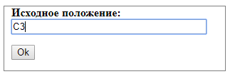
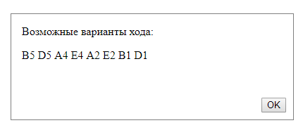

Страница содержит скрипт, выводящий все возможные ходы шахматного коня из заданной позиции. 
В качестве входящего параметра принимается текущее положение фигуры.

Пример:

&nbsp;&nbsp;&nbsp;&nbsp;ввод: C3

&nbsp;&nbsp;&nbsp;&nbsp;вывод: B5 D5 A4 E4 A2 E2 B1 D1

